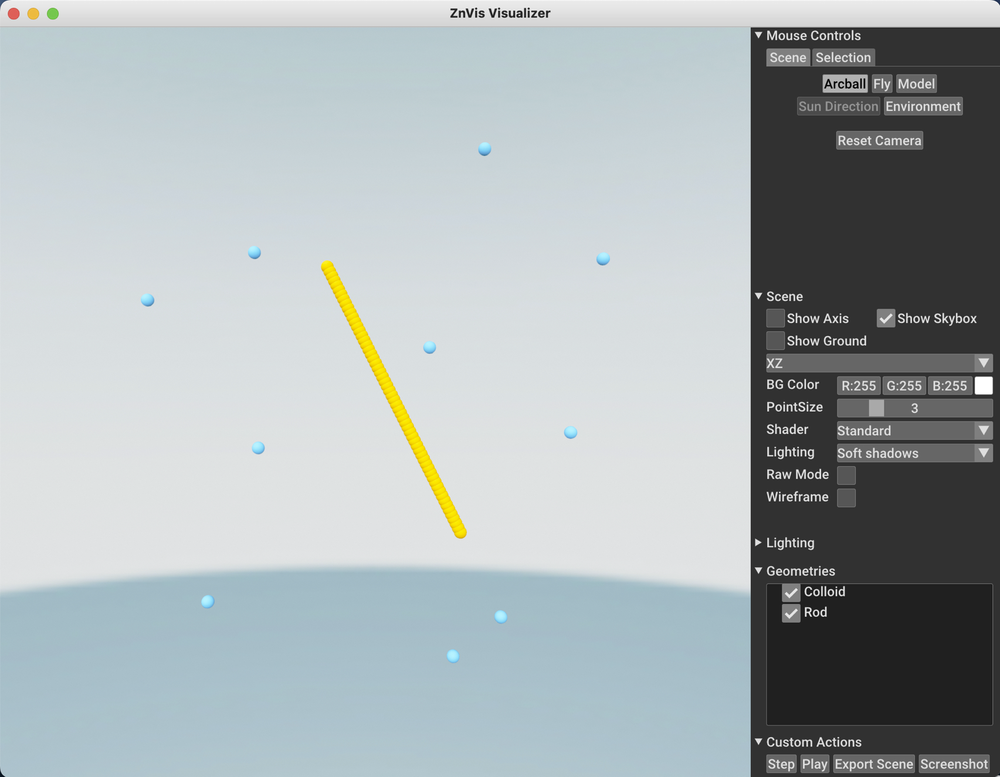

[](https://github.com/psf/black/)
[](https://github.com/zincware)
[](https://coveralls.io/repos/github/zincware/ZnVis/badge.svg?branch=main)


# ZnVis

ZnVis is a visualisation engine for particle simulation data.
Simply define the particles in the simulation with details including their positions,
colour, direction, and shape, and the visualization engine will display the system
using the Open3D engine.
ZnVis works both from a Python script and in Jupyter!

ZnVis can currently perform the following tasks:

* Visualize simulations and trajectories
* Create spherical and cylindrical mesh's for visualization
* Handle custom mesh objects
* Export png stills from the visualizer
* Export scences as `.obj` files.

## Installation

ZnVis is a purely Python package hosted on PyPi.
It can therefore be installed using pip with:

```sh
pip install znvis
```

If you prefer to access the source code, run the following from a terminal:

```sh
   git clone https://github.com/zincware/ZnVis.git
   cd ZnVis
   pip install .
```

Once complete, you will be able to start using the visualizer by importing it as:

```python
import znvis
```

## How does it work?

ZnVis is essentially a convenience wrapper of the 
[Open3D](https://github.com/isl-org/Open3D) project with a focus on mesh visualization.
The idea came out of wanting a simple way of visualizing particle trajectories from 
numpy arrays directly from a simulation script.

Below we show an example script from a reinforcement learning experiment built using
*Shameless plug alert* [SwarmRL](https://github.com/SwarmRL/SwarmRL)

```python
import numpy as np
import h5py as hf

import znvis as vis

# Load data from the database
with hf.File("training/trajectory.hdf5", 'r') as db:
    positions = db["colloids"]["Unwrapped_Positions"][:]

# Split data for convenience
colloid_positions = positions[:, 0:10, :]
rod_positions = positions[:, 10:, :]

# Create free colloid mesh
colloid_mesh = vis.Sphere(radius=2.14, colour=np.array([30, 144, 255]) / 255, resolution=10)
colloid_particle = vis.Particle(name="Colloid", mesh=mesh, position=colloid_positions)

# Create rod colloid mesh
rod_mesh = vis.Sphere(radius=2.14, colour=np.array([255, 140, 0]) / 255, resolution=10)
rod_particle = vis.Particle(name="Rod", mesh=mesh, position=rod_positions)

# Run the visualizer
visualizer = vis.Visualizer(particles=[colloid_particle, rod_particle], frame_rate=80)
visualizer.run_visualization()
```

Just like that, a visualization window (shown below) will pop up from which you can play 
the trajectory and watch your RL agents rotate a rod.


